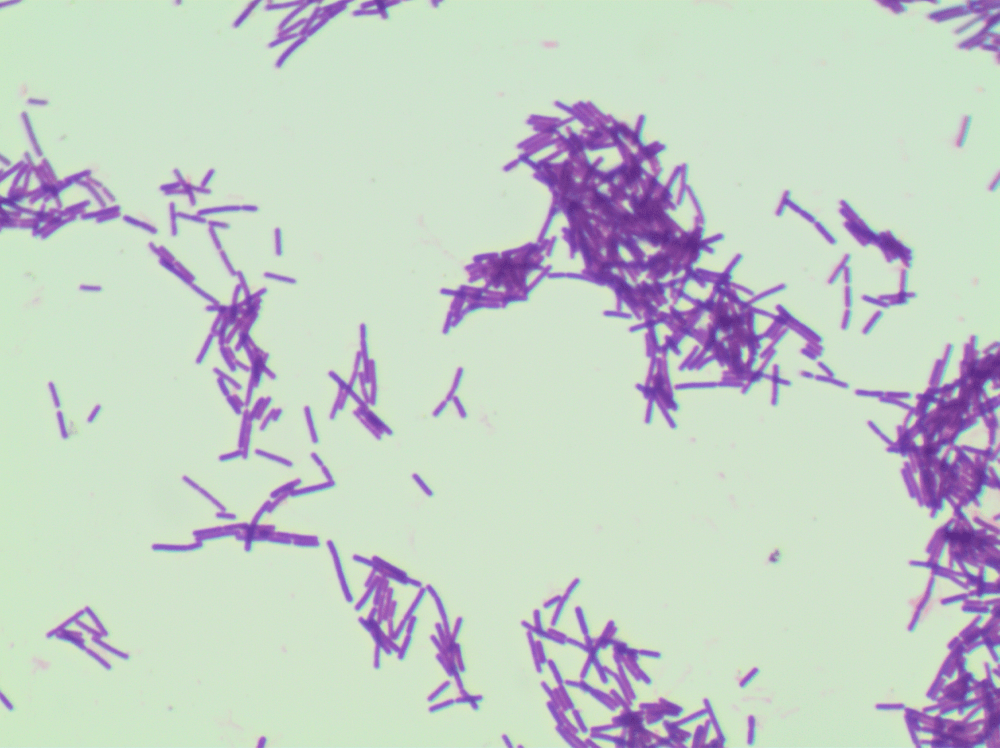

  
 

 
# Bacteria Digital Image Classification

Academic research in the field of **Deep Learning (CNN)**

## The Dataset:

|Species|Number|
|:---:|:---:|
|Lactobacillus johnsonii|20|
|Listeria monocytogenes|22|
|Propionibacterium acnes|23|
|Veionella|22|
|Staphylococcus aureus|20|
|Enterococcus faecium|20|
|Lactobacillus gasseri|20|
|Streptococcus agalactiae|20|
|Actinomyces Israeli|23|
|Fusobacterium|23|
|Pseudomonas aeruginosa|20|
|Lactobacillus plantarum|20|
|Lactobacillus reuteri|20|
|Clostridium perfringens|23|
|Neisseria gonorrhoeae|23|
|Proteus|20|
|Acinetobacter baumanii|20|
|Lactobacillus casei|20|
|Bacteroides fragilis|23|
|Porfyromonas gingivalis|23|
|Escherichia coli|20|
|Lactobacillus crispatus|20|
|Bifidobacterium spp|23|
|Staphylococcus saprophiticus|20|
|Lactobacillus salivarius|20|
|Lactobacillus delbrueckii|20|
|Lactobacillus jehnsenii|20|
|Candida albicans|20|
|Lactobacillus rhamnosus|20|
|Micrococcus spp|21|
|Lactobacillus paracasei|20|
|Enterococcus faecalis|20|
|Total|689|

This project made use of the Digital Image of Bacterial Species, found here: http://misztal.edu.pl/software/databases/dibas/ . There are 33 classes of bacteria with around 20 examples each. A copy of the dataset has been uploaded to google drive; can be found here https://drive.google.com/drive/folders/1BlLxXkBJyz3nJojqsFmztc-SngMdFF4J?usp=sharing 

## The Model (Xception):
Xception Architecture to classify species and genera of bacteria. a Stratified-5-Folds cross validation was used to validate the performance of the model, An average of **99.71%** accuracy has been achieved, competing and even beating published State-of-The-Art models. The Keras library was used with Tensorflow backend.

The accuracy of the folds..
|Fold|Validation accuracy (%)|
|:---:|:---:|
|Fold-1 |99.28%|
|Fold-2 |99.28%|
|Fold-3 |100%|
|Fold-4 |100%|
|Fold-5 |100%|
|**Average**|**99.71%**|

A. Alaodat, M.Aloudat: **For a better Classification of Bacteria Digital Image using Deep Learning**, "under revision"
