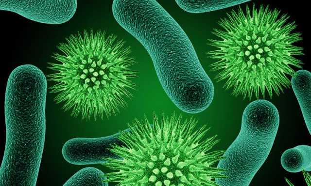

 

 
# Bacteria Digital Image Classification

Academic research in the field of **Deep Learning (CNN)**

## The Dataset:

This project made use of the Digital Image of Bacterial Species, found here: http://misztal.edu.pl/software/databases/dibas/ . There are 33 classes of bacteria with around 20 examples each. A copy of the dataset has been uploaded to google drive; can be found here https://drive.google.com/drive/folders/1BlLxXkBJyz3nJojqsFmztc-SngMdFF4J?usp=sharing 

|#|Species|Count|
|:---:|:---:|:---:|
|1|Lactobacillus johnsonii|20|
|2|Listeria monocytogenes|22|
|3|Propionibacterium acnes|23|
|1|Veionella|22|
|1|Staphylococcus aureus|20|
|1|Enterococcus faecium|20|
|1|Lactobacillus gasseri|20|
|1|Streptococcus agalactiae|20|
|1|Actinomyces Israeli|23|
|1|Fusobacterium|23|
|1|Pseudomonas aeruginosa|20|
|1|Lactobacillus plantarum|20|
|1|Lactobacillus reuteri|20|
|1|Clostridium perfringens|23|
|1|Neisseria gonorrhoeae|23|
|1|Proteus|20|
|1|Acinetobacter baumanii|20|
|1|Lactobacillus casei|20|
|1|Bacteroides fragilis|23|
|1|Porfyromonas gingivalis|23|
|1|Escherichia coli|20|
|1|Lactobacillus crispatus|20|
|1|Bifidobacterium spp|23|
|1|Staphylococcus saprophiticus|20|
|1|Lactobacillus salivarius|20|
|1|Lactobacillus delbrueckii|20|
|1|Lactobacillus jehnsenii|20|
|1|Candida albicans|20|
|1|Lactobacillus rhamnosus|20|
|1|Micrococcus spp|21|
|1|Lactobacillus paracasei|20|
|1|Enterococcus faecalis|20|
|Total|689|

## The Model (Xception):
Xception Architecture to classify species and genera of bacteria. a Stratified-5-Folds cross validation was used to validate the performance of the model, An average of **99.71%** accuracy has been achieved, competing and even beating published State-of-The-Art models. The Keras library was used with Tensorflow backend.

The accuracy of the folds..
|Fold|Validation accuracy (%)|
|:---:|:---:|
|Fold-1 |99.28%|
|Fold-2 |99.28%|
|Fold-3 |100%|
|Fold-4 |100%|
|Fold-5 |100%|
|**Average**|**99.71%**|

A. Alaodat, M.Aloudat: **For a better Classification of Bacteria Digital Image using Deep Learning**, "under revision"
